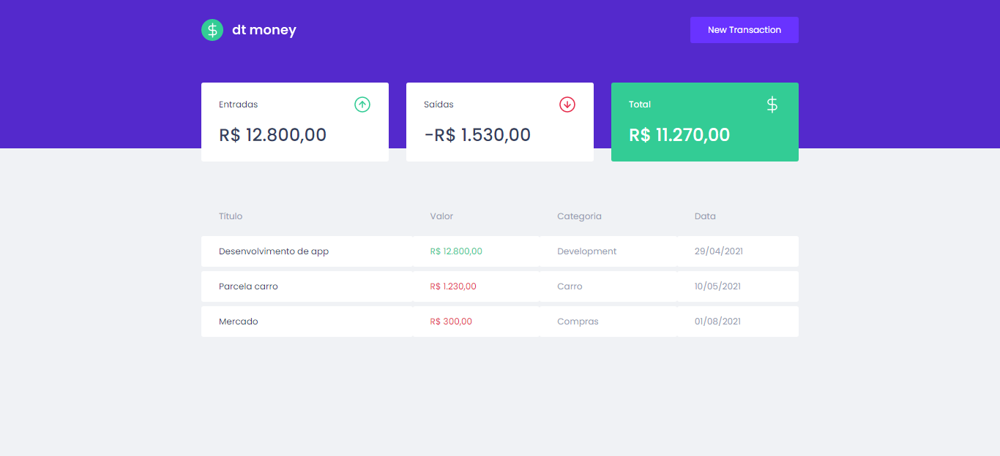
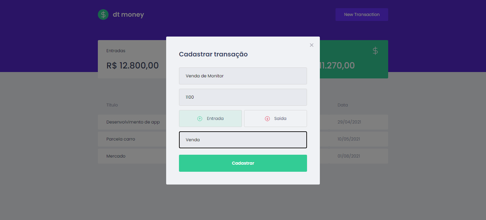

<h1 align="center">
  
</h1>

 

## 🚀 | Technologies

This project was developed with the following technologies:

- [React](https://reactjs.org)
- [Context API](https://pt-br.reactjs.org/docs/context.html)
- [TypeScript](https://www.typescriptlang.org/)
- [Styled Components](https://styled-components.com/)

## 🔖 | Project

Developed during `Rocketseat` classes, this application is a personal finance manager.
I'm studying a way to implement some graphics too, in addition to other features..

 

## 💻 | Layout

  
  

